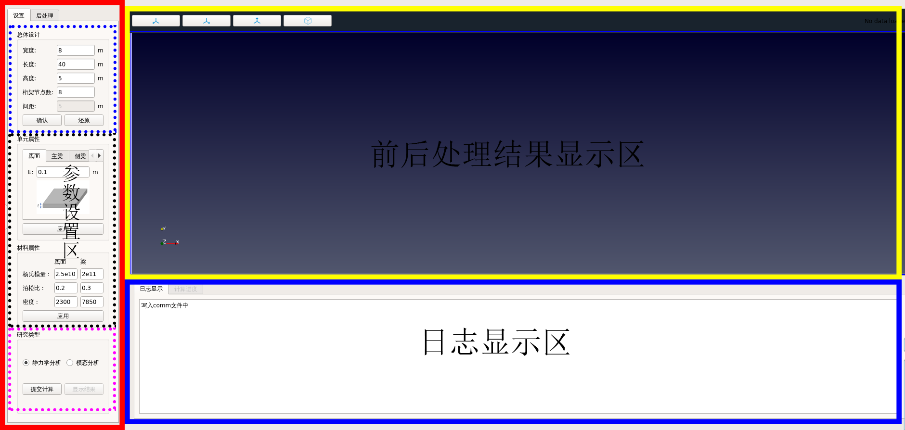

# TBridgeDesigner用户指南
## （一）TBridgeDesigner概述
前后处理基于开源软环salome v9.4
求解基于开源结构有限元软件code_aster v14.6
## （二）TBridgeDesigner使用方法
### 2.1 软件界面概述

软件界面主要分为三大区域：参数设置区、前后处理结果显示区、日志显示区，见上图中红色、黄色和蓝色框。其中，参数设置区又分为三大部分：总体设计、单元和材料参数设置、研究类型，见红色框中的虚线框。参数设置区为用户主要操作区域，前后处理结果显示区和日志显示区为辅助区域。下面按照实际使用过程的顺序，依次介绍参数设置区域各部分。
### 2.2 使用步骤
- 设计
首先对桁架桥进行设计。在<u>总体设计区</u>，可以修改桁架桥的宽度、长度、高度及桁架节点数，点击**确认**即可得到设计结果并于右侧<u>前后处理结果显示区</u>显示，如图所示。此外，点击**还原**可返回默认设计。
接着对桁架桥不同部分的单元属性和材料属性进行设置。例如，底面是壳单元，可设置其厚度；其余部分为梁单元，可设置其截面属性。点击**应用**按钮即可更新设置，同时在<u>日志显示区</u>输出“写入comm文件”。若修改完后没有点击应用，则为软件启动时的默认参数。
- 计算
最后，选择研究类型，分为静力学分析和模态分析。勾选感兴趣的研究后，点击**提交计算**并进行最后的设置。若选择静力学分析，则需在弹窗中输入给底面施加的压强；若选择模态分析，则需在弹窗中输入所需特征频率的阶数。之后点击“ok”即正式提交计算，可以看到在<u>日志显示区</u>输出的code-aster求解器返回的信息。
- 结果
  上述步骤成功完成后，点击**显示结果**按钮可查看有限元分析结果。显示的结果与勾选的研究类型相关。若勾选了静力学分析，则点击后显示静力学分析结果，结果分为位移和应力，在弹窗中选择感兴趣的结果，单击“ok”后将显示位移或应力云图；若勾选了模态分析结果，则点击后显示模态分析结果，在弹窗中选择相应的特征频率，单击“ok”后将显示相应的模态。
- 注意事项

  1. 完成上述过程后，若重新进行设计但没有提交计算，则显示的结果仍是重新设计之前的结果。
  2. 若想进行更细化的后处理，请点击<u>参数设置区</u>最上方**后处理**标签页激活Paraview。